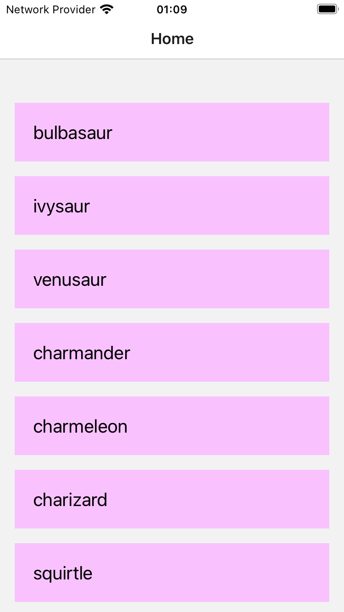
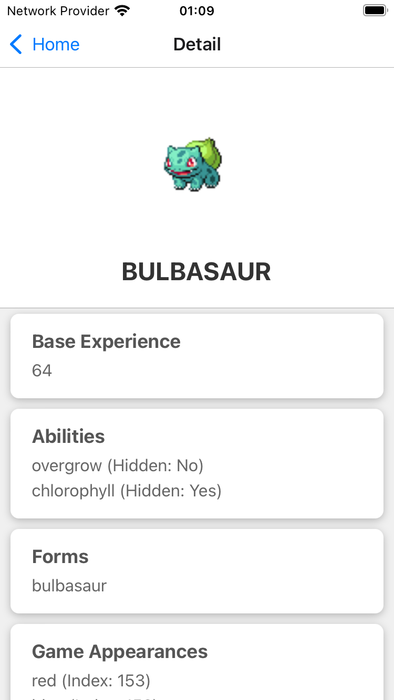

# Pokemon App

PokeApp is a mobile application built with React Native, utilizing the Pokémon API to display a list of Pokémon and their detailed statistics. This app demonstrates the use of modern mobile development techniques and libraries including React Navigation and Axios for API integration.

## Preview

<p align="center">
  
  
  
</p>

## Features

- **List of Pokémon**: Users can browse a list of Pokémon, loaded dynamically from the Pokémon API.
- **Detailed View**: Users can tap on a Pokémon to see detailed statistics about it.
- **Search and Pagination**: Includes features like searching for Pokémon and infinite scrolling pagination.
- **Cross-Platform**: Compatible with both iOS and Android devices.


## Getting Started

Follow these instructions to get the project up and running on your local machine for development and testing purposes.

### Prerequisites

What you need to install the software:

- Node.js
- npm or Yarn
- React Native CLI (not Expo)
- Android Studio or Xcode (for iOS development)

### Installing

A step-by-step series of examples that tell you how to get a development environment running:

1. **Clone the repository:**
   ```bash
   git clone https://github.com/just1and0/PokemonApp.git
   cd PokemonApp
2. **Install dependencies:**
   ```bash
   npm install

   or if you are using Yarn:
   yarn install
3. **Run the app:**
   ```bash
   For iOS:
      npx react-native run-ios

   For Android:
       npx react-native run-android


   or if you are using Yarn:
   yarn install

### Technology Stack
- React Native: A framework for building native apps using React.
- TypeScript: Ensures robustness and scalability with strong typing.
- React Navigation: Manages navigation between different screens.
- Axios: Handles API requests.
- Jest: For unit testing.

### Project Structure
 
1. **Clone the repository:**
   ```lua
   PokeApp/
   |-- src/
   |   |-- screens/
   |   |   |-- HomeScreen.tsx
   |   |   `-- DetailScreen.tsx
   |   `-- utils/
   |       |-- api.ts
   |       `-- types.ts
   |-- App.tsx
   |-- AppNavigator.tsx
   `-- README.md
